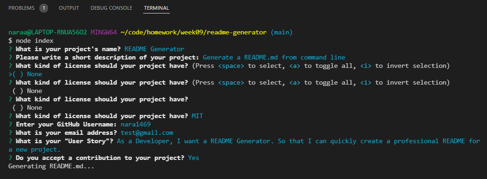

# 09 Node.js Homework: Professional README Generator

## Table of Contents 

- [Description](#description)
- [User Story](#story)
- [Installation Guide](#installation)
- [My Solution](#my-solution)
- [How to Contribute](#how-to-contribute)
- [Sample README](#sample)
- [Questions](#questions)

## Description

When creating an open source project on GitHub, it’s important to have a high-quality README for the app. This should include what the app is for, how to use the app, how to install it, how to report issues, and how to make contributions&mdash;this last part increases the likelihood that other developers will contribute to the success of the project. 

This is a command-line application that dynamically generates a professional README.md file from a user's input using the [Inquirer package](https://www.npmjs.com/package/inquirer) This allows the project creator to devote more time to working on the project.

## User Story

```
AS A developer
I WANT a README generator
SO THAT I can quickly create a professional README for a new project
```

## Installation Guide

Clone the repository then run the following command at the root directory as by default to install all necessary dependencies.

```
npm i
```
    
Once you have the modules installed in the root directory run the following command to run the application.
    
```
node index
```

Because this application won’t be deployed, here is a link to a walkthrough video that demonstrates its functionality. [Walkthrough Video - GIF format](./utils/readme-video.gif)

## My Solution

This command-line application can quickly and easily create a README file  from a user's input using the `Inquirer package`. This task comes with the starter code. The repo includes a `package.json` with the required dependencies. Be sure to create your `.gitignore` file before installing any npm dependencies.

A high-quality, professional README.md is generated with the title of a project and sections entitled Description, Table of Contents, License,  Installation Guideline, User Story, Contributing, and Open to Feedback Information.

When a user inputs the following questions /inquirer.promt(questions)/, the answers are passed to generateMarkdown. To pass this data object between index.js and generateMarkdown.js I used the `object destructuring` and `modularization` methods. The `questions` array:

- What is your project's name? 
- Description of your project?
- What kind of license should your project have? 
- What is your GitHub username?
- What is your email address? 
- What is your "User Story"? 
- Do you have an Installation Guideline?
- Do you have a Contribution Guideline?

For a license entry, you are able to choose a license from a list of options. /inquirer input type: `checkbox`/
Then a badge for that license is added near the top of the README and a notice is added to the section of the README entitled License that explains which license the application is covered under. /function renderLicenseBadge() default value: empty string/

Your GitHub username and email information are used in Questions section to get feedback with a link. 

When you click on the links in the Table of Contents, then you are taken to the corresponding section of the README. This is able to help with using the right markdown syntax.

## How to Contribute

If you want to contribute the repo, follow the next steps:

- Create your own git branch
- Push it to the repository
- Create a Pull Request
    
If the PR is approved by the administrator, the code will be merged into the main branch!

## Sample README

Here is a sample README.md file as a result of this application. [README.md](./utils/README.md).
Also, a walkthrough video demonstrating the functionality of the application. 

- [Walkthrough Video - Screen Castify Format](./utils/README-generator-video.webm) 
- [Walkthrough Video - Mp4 Format](./utils/readme-video.mp4)
- [Walkthrough Video - GIF format](./utils/readme-video.gif)

Screenshots: For User inputs from the command line in Terminal


## Questions

If you have any questions about the repo, open an issue or contact me directly at naraamtm@gmail.com. You can find more of my work at [GitHub](https://github.com/nara1469/).
